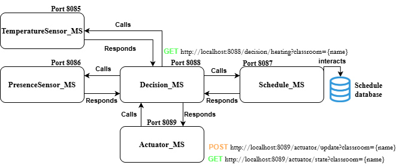

# radiateur-microservices

Cette application permet de gérer le chauffage dans les salles de cours de l'INSA Toulouse en fonction de trois facteurs : la température ambiante dans la salle de cours, la présence d'étudiants dans la salle et l'emploi du temps des cours pour la salle.

L'architecture de l'application est organisée en 5 microservices :

- **Schedule_MS**  
  Ce service est responsable de la gestion de l’emploi du temps des salles.  
  Il persiste les données liées à l’occupation des salles (heure de début, heure de fin) et fournit des endpoints permettant de consulter les cours en cours ou à venir.

- **PresenceSensor_MS**  
  Ce service simule un capteur de présence physique.  
  Il gère une liste de détections afin de déterminer si une salle est actuellement occupée ou non.

- **TemperatureSensor_MS**  
  Ce service simule des sondes de température.  
  Il permet au système de récupérer la température ambiante actuelle d’une salle donnée.

- **DecisionService_MS (Orchestrateur)**  
  Ce service constitue le cœur du système.  
  Il agrège les données provenant des services *Schedule*, *Presence* et *Temperature* afin d’évaluer la situation d’une salle et de déterminer le mode de chauffage approprié (OFF, PREHEAT ou NORMAL).

- **ActuatorService_MS**  
  Ce service simule le contrôleur physique du chauffage.  
  Il reçoit la décision du *DecisionService* (ON/OFF, température cible) et applique le nouvel état du chauffage à la salle concernée.

## Architecture du système

